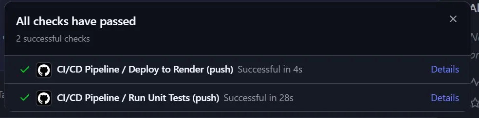
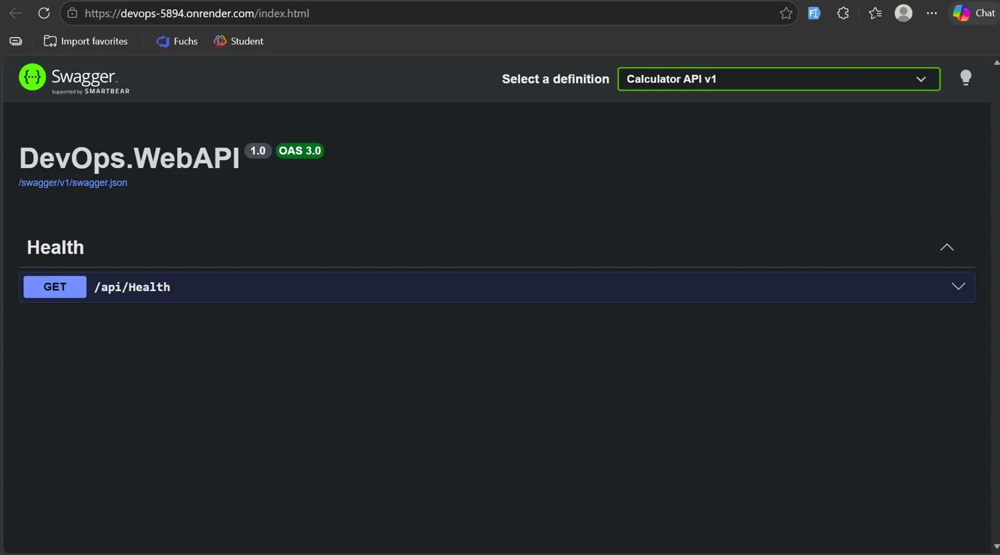
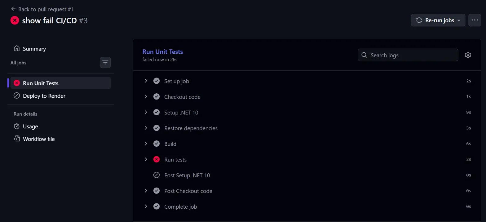

# DevOps.WebAPI

This is my submission for the CI/CD Pipeline Automation assignment. It's a small .NET 10 Web API with a unit test project, deployed to Render through a GitHub Actions pipeline that gates the deploy on tests passing.

## Live app

https://devops-5894.onrender.com/index.html

It's hosted on Render's free tier, which means the container goes to sleep after 15 minutes of inactivity. If you hit it cold, give it about 30 seconds to wake up before assuming it's broken.

## What's inside

- `DevOps.WebAPI` — an ASP.NET Core Web API with a single `/api/health` endpoint and a `CalculatorService` (Add and Subtract). Swagger UI is at the root.
- `TestProject1` — an xUnit test project that covers the calculator service.
- `Dockerfile` — multi-stage build, runs on `mcr.microsoft.com/dotnet/aspnet:10.0`.
- `.github/workflows/main.yml` — the CI/CD pipeline.

## How the pipeline works

The workflow triggers on every push to `develop` and on pull requests. It has two jobs:

1. **test** — spins up an Ubuntu runner, installs the .NET 10 SDK, restores, builds, and runs `dotnet test`. If any test fails, the job exits non-zero and GitHub marks the run as failed.
2. **deploy** — only runs if `test` succeeded (`needs: test`). All it does is `curl` the Render deploy hook stored in `RENDER_DEPLOY_HOOK` secret. That ping tells Render to pull the latest commit and rebuild the container.

That's the whole gate. If tests fail, the deploy job is skipped, Render is never told to deploy, and whatever's currently live stays live.

I also turned off Render's "Auto-Deploy on commit" setting. If I left it on, Render would deploy on every push regardless of whether tests passed, which would defeat the point. By disabling it, the GitHub Action is the only thing that can trigger a deploy.

## Screenshots

A successful pipeline run, both jobs green:

The live app responding:

A failing run — I pushed a deliberately broken test on a branch to demonstrate that the deploy job is skipped when tests fail:

## Deployment strategy

I went with a **rolling update**, mostly because that's what Render does natively on the free tier and there's no point pretending I implemented something more complex.

When a deploy is triggered, Render builds the new image and starts a new container alongside the existing one. It hits my `/api/health` endpoint on the new container until it gets a healthy response, and only then does it route traffic to it. The old container is shut down after the cutover. So at no point is the site offline, and if the new container never becomes healthy, traffic just keeps going to the old one.

I considered Blue-Green but you can't really do real Blue-Green on a single free service — that needs deployment slots or a load balancer in front of two environments. Recreate would have been simpler but it has visible downtime, which seems worse.

## Rollback

There are two ways to roll back depending on the situation.

**Quick rollback through Render's dashboard:**

1. Open the service in Render
2. Go to the **Deploys** tab
3. Find the last good deploy in the list
4. Click the menu on the right and choose "Rollback to this deploy"
5. Render redeploys the cached image — takes maybe 30 seconds since it doesn't have to rebuild

**Git-based rollback (more permanent):**

If the bad code is on `develop`, the dashboard rollback only fixes the running service — the bad commit is still there and could go out again on the next push. So afterwards I'd do: